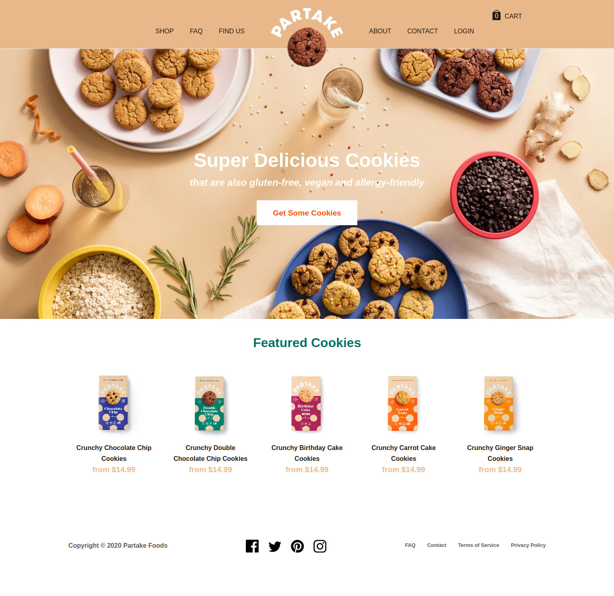
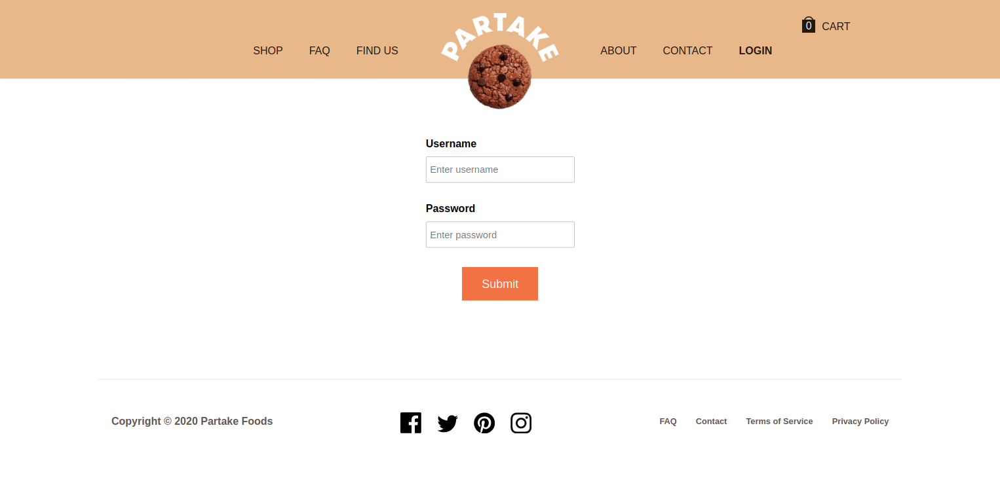
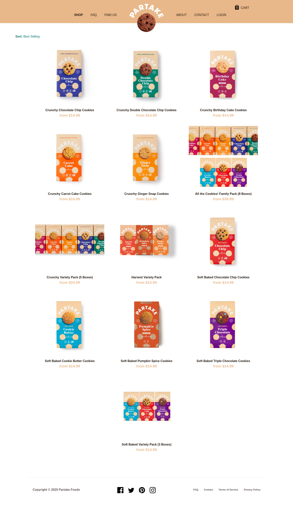

# Partake Website clone
***Note: The partake website UI has been updated so the project UI might vary from the actual website***
A clone of the partake e-commerce website clone. [Click here](https://partakefoods.com/) to see the partake website. 
 
 
[Link to project demo](https://partake-clone.netlify.app/)
## Overview
The project has the following features:
1. A landing page with the latest offers and featured items.
2. An about us page, faq page and contact page with static information about the site.
3. A login page ( *username: user*, *password: aaa*).
4. A shop page with all the items available to buy.
5. Items can be added to cart and viewed in the checkout page.

## Resources used
1. React framerwork was used to build the project.
2. React router is used to handle site navigation.
3. UI is styled with custom CSS.
4. Most of the product images were taken from the partake website.

## Project screenshots

### Landing Page

### Login Page

### Shop Page

